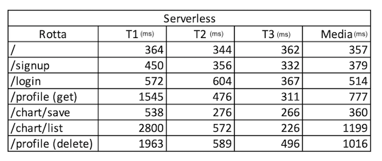
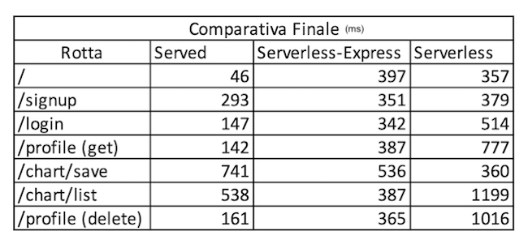

# API RESTful served e serverless

## Sommario

### <a href="#introduzione"> Introduzione </a>
- #### <a href="#api">API</a>
- #### <a href="#cloud-computing">Cloud Computing</a>
- #### <a href="#serverless-computing">Serverless Computing</a>
### <a href="#obiettivi"> Obiettivi </a>
### <a href="#strumenti"> Strumenti </a>
### <a href="#architettura"> Architettura </a>
- #### <a href="#parti-comuni"> Parti Comuni </a>
  - ##### <a href="#connessione-al-database"> Connessione al database </a>
  - ##### <a href="#model"> Model </a>
  - ##### <a href="#recupero-e-salvataggio-grafici"> Recupero e salvataggio grafici </a>
  - ##### <a href="#google-charts"> Google Charts </a>
  - ##### <a href="#served"> AWS S3 </a>
  - ##### <a href="#librerie-secondarie"> Librerie Secondarie </a>
- #### <a href="#served"> Served </a>
- #### <a href="#serverless-express"> Serverless Express </a>
- #### <a href="#serverless-lambda"> Serverless Lambda  </a>
### <a href="#test"> Test </a>
### <a href="#conclusioni"> Conclusioni </a>
### <a href="#bibliografia"> Bibliografia </a>

---

## [Introduzione](#introduzione)

Le **API (acronimo di Application Programming Interface)** sono set di definizioni e protocolli con i quali vengono realizzati e integrati software applicativi differenti tra loro. Consentono ai prodotti o servizi di comunicare con altri prodotti o servizi senza sapere come vengono implementati, semplificando così lo sviluppo delle applicazioni e consentendo un netto risparmio di tempo e denaro.

Talvolta vengono concepite come una forma di contratto, con una documentazione che rappresenta un accordo tra le parti: se la parte A invia una richiesta remota strutturata in un determinato modo, il software della parte B risponderà in un altro modo determinato.

Le API trovano applicazione in molti ambiti della programmazione, dai S.O fino al Web; l'argomento di questa trattazione sono appunto le  **API Web**. 

Dopo una fase iniziale sono stati introdotti per le API Web i primi protocolli e architetture; tra le più diffuse abbiamo: **SOAP e REST**.

Il termine **REST (acronimo di Representational State Transfer)**, introdotto nel 2000 nella tesi di dottorato di **Roy Fielding**, fa riferimento ad un’architettura software ideata per creare web API funzionanti sul protocollo *HTTP*; in realtà questo approccio architetturale funziona anche su *SNMP* o *SMTP*.

L’architettura REST si declina in una serie di vincoli e principi stabiliti dallo stesso Roy Fielding:
-	**Client-server**: separazione e definizione dei compiti tra client e server.
-	**Stateless**: principio che si basa sull’assenza di stato nella comunicazione tra client e server. Ogni richiesta deve necessariamente contenere tutte le informazioni per poter essere evasa, ogni sessione è unica e non può essere correlata con altre.
-	**Cacheable**: si può predisporre un meccanismo di cache; le risposte del server devono essere esplicitamente indicate come memorizzabili nella cache, si evitano così i classici problemi legati alla memoria cache.
-	**Layered system**: i componenti del sistema non possono "vedere" oltre il loro strato. Quindi, si possono facilmente aggiungere bilanciatori di carico e proxy per migliorare la sicurezza o le prestazioni.
-	**Uniform interface**: è il vincolo più importante, un'interfaccia uniforme tra i componenti in modo che le informazioni siano trasferite in forma standard. Questo prevede che:
    *	le risorse richieste siano identificabili e separate dalle rappresentazioni inviate al cliente.
    *	le risorse possano essere manipolate dal cliente attraverso la rappresentazione che riceve, perché essa contiene informazioni sufficienti per farlo.
    *	i messaggi autodescrittivi restituiti al cliente abbiano informazioni sufficienti per descrivere come trattarli.
    *	L'ipertesto/ipermedia sia motore dello stato dell'applicazione: accedendo alla risorsa, il client REST deve poter individuare, attraverso hyperlink, tutte le altre azioni disponibili al momento.
-	**Code on demand**: la possibilità di inviare codice eseguibile dal server al client quando richiesto, estendendo le funzionalità del client.

Poiché REST è un insieme di principi architetturali, non un protocollo né uno standard; chi sviluppa API può implementare i principi REST in diversi modi.

Un punto molto importante da chiarire è che ***REST e RESTful*** non sono esattamente la stessa cosa: REST rappresenta l’architettura, mentre RESTful rappresenta tutto ciò che viene sviluppato seguendo i principi dell’architettura REST. 

Il protocollo **SOAP (Simple Object Access Protocol)** è in uso dagli anni 90 per consentire la comunicazione tra un client ed i servizi di un server, può operare su differenti protocolli di rete, il più usato è HTTP.
SOAP si basa sul set di informazioni XML, la struttura del documento è composta da due parti:
- ***head*** (facoltativa): ontiene metadati per l'instradamento e la sicurezza;
- ***body***: trasporta il payload.

Il rispetto dei molteplici criteri delle API REST risulta più agevole del rispetto del singolo protocollo SOAP (Simple Object Access Protocol), che prevede requisiti specifici come la messaggistica XML e la conformità integrata di sicurezza e transazione, che rendono il tutto più lento e pesante. 
Ne consegue che le API REST sono ottime per scenari come l’**IoT** e lo sviluppo di **applicazioni mobile**.

Questo progetto presenta due tipi di API REST:
 - **served**: si intende un’API RESTful messa in produzione su un server, occupandosi, oltre al processo di deploy dell’API, anche della configurazione e manutenzione del server web.
 - **serverless**: per parlare di API REST in soluzioni serverless abbiamo bisogno di approfondire il concetto di cloud computing e successivamente serverless computing.

### [Cloud computing](#cloud-computing)

Esistono diverse definizioni di cloud computing, è difficile stabilire quale è corretta e quale no perché ognuna di esse rappresenta una parte del cloud computing.

Una prima definizione è la seguente: 
> Commercializzazione di risorse di calcolo, storage on-demand e consumo di risorse "pay-as-you-go".

Il National Institute of Standards and Technology(NIST), definisce il cloud computing come segue: 
> "Il cloud computing è un modello che permette l'accesso ubiquo, adattivo e su richiesta a risorse informatiche condivise e configurabili (reti, server, applicazioni, storage e servizi) che possono essere fornite e rilasciate con il minimo sforzo e interazione con il fornitore di servizi."

L'Università di Berkeley definisce: 
> Il cloud computing si riferisce alle applicazioni fornite come servizio su Internet, come l'hardware e il software nei centri dati che forniscono questi servizi.
Quest'ultima è stata poi classificata come il modello SaaS che vedremo in seguito.

L'utilizzo del cloud computing è diventato una realtà stabile grazie all’incremento vertiginoso della potenza di calcolo ed al miglioramento dei **sistemi di virtualizzazione**.

Esistono diversi modelli di cloud computing:
-	**SaaS** (software as a service): ad esempio Office 365, Gmail, l'accesso al software avviene tramite internet ed i dati sono salvati in cloud.
-	**IaaS** (infrastucture as a service): l’infrastruttura è un servizio, in pochi secondi è possibile creare una macchina virtuale per le proprie esigenze.
-	**PaaS** (platform as a service): non si richiede una macchina virtuale ma direttamente un web server, in sostanza viene richiesto direttamente quello che è necessario (senza preoccuparsi della configurazione del resto).
-	**BaaS** (backend as a service): ad esempio login con Facebook, permette di usare un servizio di un'altra applicazione, interfacciandosi tramite API. 
-	**FaaS** (function as a service): il codice viene organizzato in funzioni, ogni funzione è invocabile tramite evento. Le funzioni sono atomiche, svolgono un singolo lavoro e non devono mai restare in attesa.   

Il cloud computing presenta molti vantaggi rispetto l'impiego di server on-premise:
- aggiungere o togliere capacità (di calcolo o storage) all'infrastruttura cloud quando se ne ha bisogno, disponibile in pochi minuti;
- non c'è bisogno di preoccuparsi dell'hardware sottostante, anche se si rompe, gli strumenti cloud hanno piani di disaster recovery automatici;
- non si paga la manutenzione e l'elettricità che non si usa. Si paga solo la parte che serve e che è realmente utilizzata, massimizzando l'efficienza dello spazio fisico richiesto per soddisfare le esigenze informatiche.
  
### [Serverless computing](#serverless-computing)

Con serverless computing si intende un modello di sviluppo cloud nativo che permette agli sviluppatori di creare e rendere eseguibili le applicazioni senza gestire i server, o meglio, i server vengono utilizzati ma sono astratti dallo sviluppo delle app. In pratica, con il serverless computing si delega a un vendor l’esecuzione del codice lato server. Il modello FaaS del cloud computing è quello che si sposa meglio con il serverless computing. 

Il modello serverless è diverso dagli altri modelli di cloud computing, poiché il provider di servizi cloud è responsabile di gestire sia l'infrastruttura cloud che la scalabilità delle app. Le app serverless vengono distribuite in container che vengono avviati on demand al momento della chiamata.

## [Obiettivi](#obiettivi)

L'obiettivo principale di questo progetto è confrontare API RESTful served e serverless.

Per le API Served viene proposto un unico modello, per le Serverless invece vengono proposti due modelli con differenze sostanziali.

Il confronto qualitativo e quantitativo fra i tre modelli è articolato in quattro punti:
- tempistiche e complessità di sviluppo;
- costo di deploy e mantenimento;
- problematiche e vantaggi legati agli aggiornamenti;
- affidabilità e sicurezza;
- prestazioni.

## [Strumenti](#strumenti)

Tutti gli strumenti utilizzati per lo sviluppo del progetto sono open source o gratuiti. 

### Visual Studio Code
[Visual Studio Code](https://code.visualstudio.com), con i seguenti plugin:
- [Javascript ES6 Code Snippets](https://marketplace.visualstudio.com/items?itemName=xabikos.JavaScriptSnippets);
- [Typescript](https://marketplace.visualstudio.com/items?itemName=ms-vscode.vscode-typescript-next);
- [Yaml](https://marketplace.visualstudio.com/items?itemName=redhat.vscode-yaml);
- [Markdown](https://marketplace.visualstudio.com/items?itemName=yzhang.markdown-all-in-one);

### Typescript 
La scelta di [Typescript](https://www.typescriptlang.org) al posto di Javascript è motivata da una compatibilità maggiore da parte del linguaggio di casa Microsoft e da un miglior controllo degli errori grazie alla tipizzazione.

### NodeJS
Il framework per il backend è [NodeJS](https://nodejs.org/en/), con il gestore di pacchetti [NPM](https://www.npmjs.com).

### VPS
Per le API Served è stato utilizzato un server VPS, attivato su [Aruba](https://www.cloud.it/vps/vps-hosting.aspx):
-  1 vCPU;
- 2GB RAM;
- 40 GB SSD
- uptime garantito del 99,8%.
- S.O [Debian 10](https://www.debian.org)
- Web Server [Nginx](https://nginx.org/en/#basic_http_features). 

### ExpressJS
Per le API served e serverless-express è stata usata la libreria [Express](https://expressjs.com) per la gestione del routing interno all'applicazione.

### Serverless Framework
Per le sole versioni serverless, è stato usato il framework [SERVERLESS](https://www.serverless.com).
Tale scelta garantisce una maggiore compatibilità tra i vari vendor, permettendo di effettuare il deploy sui vendor più conosciuti cambiando poche righe nel file di configurazione serverless.yml.

Il framework viene installato come pacchetto NPM, è consigliata l'installazione globale per poter usufruire a pieno delle potenzialità della CLI di Serverless: `npm install -g serverless`; successivamente è necessario configurare le credenziali per l'accesso al vendor scelto: `serverless config credentials --provider provider --key key --secret secret`.

Infine, è necessario installare il framework a livello di applicazione: `npm install --save serverless-http`.

Serverless mette anche a disposizione una dashboard online, con funzioni di monitoraggio gratuite e soluzioni professionali a pagamento.

### Amazon AWS

Il vendor scelto per effettuare i test è AWS, che offre moltissimi servizi rivolti al cloud computing. 
Il progetto usa:
  - [API GATEWAY](https://aws.amazon.com/it/api-gateway/), per la gestione delle richieste HTTP;
  - [AWS LAMBDA](https://aws.amazon.com/it/lambda/?nc2=type_a), per l'esecuzione vera e propria del codice;
  - [AWS S3](https://aws.amazon.com/it/s3/faqs/), come storage per il caricamento del codice al momento del deploy e per salvare i dati dell'utente.

### MongoDB

Il database usato per l'autenticazione è un [MongoDB](https://www.mongodb.com/it), in cloud su [Mongo Atlas](https://www.mongodb.com/cloud/atlas).

Per gestire il database dal computer di sviluppo è stato utilizzato [Mongo Compass](https://www.mongodb.com/products/compass).

### JWT
La tecnologia alla base dell'autenticazione è [JWT](https://jwt.io).

La gestione del JWT presenta due problemi:
- il furto del token consente al ladro di impossessarsi, per il tempo di validità del token, dell'identità dell'utente;
- il token ha un tempo di vita stabilito, se l'utente cessa le richieste prima di questa scadenza, il token rimane comunque valido. 
Queste problematiche rendono difficile il controllo dei token; per arginarle sono previsti due metodi:
  -  memorizzare i token validi all'interno del database ed al momento del logout dell'utente eliminare il token dal database. Anche se il token venisse rubato, al controllo successivo otterremo un JWT valido ma non presente nella lista dei token attivi, quindi verrebbe scartato;
  -  memorizzare i token invalidati in seguito al logout, fino alla scadenza effettiva del token. Questa tecnica è complementare alla precedente ma richiede un ulteriore lavoro per il confronto tra il token invalidato e l'effettiva scadenza del token.
  
Il processo di verifica, che effettua un doppio controllo, richiede più risorse e tempo ma garantisce una maggiore sicurezza. 

Nell'applicazione proposta, che non ha la sicurezza come core, si è scelto di utilizzare il controllo singolo sul JWT. 

Il **JWT** contiene all'interno del payload anche l'id dell'utente, quindi passando il token viene individuato univocamente l'utente che effetua la richiesta. 

### Google Charts

Vengono inoltre utilizzate le API di [Google Chart](https://developers.google.com/chart/image/docs/making_charts) che vengono consulate tramite chiamate HTTP e restituiscono l'immagine desiderata.

### Postman

Infine, per testare l'applicazione è stato utilizzato il software [Postman](https://www.postman.com), quest'ultimo permette di effettuare chiamate HTTP, con eventuale passaggio di parametri, restituendo e visualizzando la risposta ottenuta dal server.

## [Architettura](#architettura)

Il progetto propone tre architetture che perseguono lo stesso obiettivo con modalità differenti:
- Served 
- Serverless Express
- Serverless Lambda

Poiché in tutte le soluzioni proposte vengono svolti gli stessi compiti, alcune parti di codice sono comuni.

Il flusso dell'applicazione permette la registrazione degli utenti attraverso email e password ed il login con i dati scelti.

Una volta loggato, l'utente può accedere alle rotte protette dal middleware dell'autenticazione e specificatamente: 
- profilo: permette di recuperare i dati del profilo dell'utente;
- eliminazione del profilo: elimina tutti i dati collegati all'utente;
- generazione e salvataggio di un grafico;
- lista di tutti i grafici dell'utente.

è anche prevista la rotta di "servizio" per verificare se l'applicazione è online.

Nel codice sono state documentate tutte le rotte e per ognuna di esse vengono specificati  metodo e parametri di chiamata.

### [Parti Comuni](#parti-comuni)
#### [Connessione al database](#connessione-al-database)

Contenuta nella cartella ***database***, la gestione della connessione al database è affidata a [Mongoose](https://mongoosejs.com), un **Object Data Mapper** che utilizza il driver di MongoDB e lo astrae per facilitare la connessione. 

Nel file `database.ts` vengono esportante le funzioni `connect()` e `disconnect()`, la prima prende i parametri dal file `config.ts` e stabilisce la connessione con il dabatase, la seconda si occupa della chiusura della connessione.

##### [Model](#model)

All'interno della cartella ***database/users/*** è presente la definizione del modello con la quale è possibile definire degli oggetti che mappano un documento MongoDB.

All'interno dell'applicazione il model è stato usato per definire lo schema ed il modello dell'utente:

`const UserSchema = new Mongoose.Schema({
  _id: String,
  password: String,
});` 

`export const UserModel = Mongoose.model<IUser>(
  "user",
  UserSchema
) as IUserModel;`

Tramite lo schema ed il modello è possibile istanziare oggetti ***User*** ed utilizzarli per il processo di autenticazione.

#### [Recupero e salvataggio dei grafici](#recupero-e-salvataggio-dei-grafici)

Nell'ottica dei ***microservizi***, per la creazione e lo storage dei grafici sono stati utilizzati servizi esterni, rispettivamente: 
- Google Charts
- AWS S3

##### [Google Charts](#google-charts)

Le API di Google Charts quando interrogate, tramite ***GET*** o ***POST***, restituiscono l'immagine del grafico parametrizzato. Nel progetto, le API di Google Charts vengono chiamate solo tramite GET.

Per la definizione del grafico attraverso i parametri richiesti è possibile consultare la [documentazione](https://developers.google.com/chart/image/docs/chart_params) delle API.

La rotta dell'applicazione che si occupa di salvare il grafico è di tipo POST e riceve il parametro ***chart*** con una mappatura 1 ad 1 con la documentazione di Google Charts, come nel esempio seguente:

`cht=p3&chs=250x100&chd=t:60,40&chl=Hello|World`

##### [AWS S3](#aws-s3)

È un servizio di storage che offre scalabilità, disponibilità e sicurezza dei dati, con un uptime del 99,999999999%.

Nel progetto è stato utilizzato tramite l'apposito SDK: `import AWS from 'aws-sdk';`.

[Amazon S3](https://aws.amazon.com/it/s3/) viene usato per salvare i grafici dell'utente e per recuperare gli oggetti salvati.

### [Served](#served)

**Struttura del progetto:**
- dist: contiene il codice javascript ottenuto dalla compilazione del progetto typescript, è il codice che viene realmente eseguito sul server;
- node_modules: contiene i moduli NodeJS, installati tramite NPM, necessari al funzionamento dell'applicazione;
- src:
  - database: descritta nella sezione [parti comuni](#parti-comuni);
  - middleware: contiene il middleware per la verifica degli utenti autenticati;
  - app.ts: è il core dell'applicazione, contiene l'applicazione Express e tutte le rotte del progetto;
  - config.ts: non è presente all'interno del repository ma è necessario al funzionamento dell'applicazione. Contiene i dati sensibili:
    - account del database;
    - parola segreta del jwt;
    - porta su cui viene eseguta l'applicazione;
- package.json e package-lock.json: contengono la definizione delle dipendenze installate da NPM;
- tsconfig.json: definisce le regole di compilazione dei file Typescript.

L'architettura Served è in un certo senso la più "classica", prevede l'utilizzo di un [server personale](#vps) ed un web server Nginx per rendere disponibili le API.

Il flusso dell'applicazione in questo caso prevede che l'utente effettui una richiesta, ad esempio:

`http://cer.eliapacioni.cloud/`

La richiesta viene ricevuta dal web server sulla porta 80. A questo punto, essendo Nginx configurato come server block e reverse proxy, instrada la richiesta all'applicazione collegata al blocco `cer` e la inoltra alla porta **3000** su cui è in ascolto l'applicazione Nodejs.

L'applicazione passa la richiesta alla libreria **Express** che la incapsula nell'oggetto **Request** e tramite il router interno invoca la rotta desiderata, nell'esempio: '**/**', definita come rotta di servizio.

Il risultato della consultazione è incapsulato nell'oggetto **Response** ed inviato al client sotto forma di **JSON**.

Il flusso descritto è valido per le rotte che non richiedono l'autenticazione, nel caso di rotte autenticate è necessario passare attraverso il middleware **authentication**.

In questo caso, dopo aver incapsulato la richiesta nell'oggetto **Request**, verrà invocato il middleware per verificare il **JWT** dell'utente:
- se il token è valido, i dati contenuti nel payload vengono iniettati, attraverso il middleware **authentication**, nell'oggetto **Request** di Express e l'esecuzione prosegue invocando la rotta richiesta; 
- se il token è scaduto o non valido l'esecuzione viene bloccata e viene restituito, tramite l'oggetto **Response**, l'errore `401`.

Per iniettare i dati attraverso il middleware **authentication** nell'oggetto **Request** di Express è necessario modificare l'oggetto **Request** definendo i campi aggiuntivi necessari: 

`declare global { 
  namespace Express { 
    interface Request { 
      decoded?: any, 
      input_files?: any 
      } 
    } 
  }`

Tale modifica è richiesta dall'utilizzo di Typescript, nel caso di Javascript, non essendo effettuato alcun controllo sui tipi, avremmo potuto effettuare una semplice assegnazione.
In Typescript, se non viene dichiarata la proprietà, al momento dell'assegnazione verrà sollevata un'eccezione e restituirà un errore.

#### Deploy
 
Per effettuare il deploy è necessario:
- configurare il sistema: installando i linguaggi ed i moduli necessari all'applicazione, nel caso di un server condiviso tra più applicazioni è necessario verificare la compatibilità/incompatibilità con i pacchetti di altre applicazioni;
- web server: creare il **server block** dell'applicazione e configurarlo per ascoltare ed indirizzare sulle porte desiderate;
- caricare il codice dell'applicazione nella cartella a cui punta il server block;
- installare le librerie ed i pacchetti collegati alla nostra applicazione.

#### Monitoraggio
Per monitorare l'applicazione viene utilizzato [PM2](https://pm2.io), un ***daemon process manager*** che aiuta a gestire e mantenere l'applicazione online 24/7.

L'installazione di PM2 avviene tramite NPM, come un pacchetto globale: `npm install pm2 -g`

Per avviare l'applicazione si usa: `pm2 start app.js --watch --name cer`, con questo comando viene assegnato il nome ***cer*** all'applicazione avviata e con la direttiva ***watch*** viene indicato a PM2 di riavviare l'applicazione ogni volta che viene modificato il codice sorgente, per rendere gli aggiornamenti immediatamente disponibili.

#### Aggiornamento

Al momento dell'aggiornamento dell'applicazione è necessario interrompere l'intera applicazione, a causa della struttura monolitica. Solo alla fine dell'aggiornamento verrà resa nuovamente disponibile l'applicazione.

Questa procedura viene spesso evitata attraverso l'utilizzo di server temporanei, quest'ultima soluzione prevede l'utilizzo di un server su cui configurare temporanemente l'intera applicazione e a cui far puntare il dominio per il tempo necessario all'aggiornamento, per poi puntare il dominio al server aggiornato ed eliminare il server temporaneo.

Questa soluzione è efficace ma presenta costi elevati dovuti all'utilizzo di più macchine ed ai tempi di configurazione necessari per entrambi i server.

Con ***PM2*** e la direttiva watch, non è necessario l'impiego di altri server ed il tempo in cui l'applicazione è offline viene notevolmente ridotto. 

Ad ogni modo, sarà sempre presente un downtime.

#### Affidabilità e sicurezza
L'affidabilità della nostra applicazione è legata alla struttura su cui la stiamo eseguendo e che dobbiamo direttamente gestire. Quindi è intrinsecamente legata alla preparazione del team che mantiene il progetto.

#### Prestazioni
Le prestazioni possono essere ottime e dipendono direttamente dalla macchina o dal cluster dove l'applicazione viene eseguita. 
Ipotizzando di avere un server dedicato per l'applicazione, le prestazioni saranno massime. Spesso non verranno sfruttate interamente le caratteristiche della macchina perché l'applicazione potrebbe non richiedere tutta la potenza di calcolo o memoria messa a disposizione.

La scabilità è affidata al sistemista del progetto e può essere:
- verticale: potenziando il singolo server;
- orizzontale: predisponendo manualmente un cluster su cui eseguire l'applicazione.

Ad ogni modo, è limitata alle risorse acquistate o noleggiate dall'azienda. 

### [Serverless Express](#serverless-express)

Struttura del progetto:
- .build: contiene il codice javascript ottenuto dalla compilazione del progetto typescript, è il codice che viene realmente eseguito sul server;
- node_modules: contiene i moduli NodeJS, installati tramite NPM, necessari al funzionamento dell'applicazione;
- src 
  - database: descritta nella sezione [parti comuni](#parti-comuni)
  - middleware: contiene il middleware per la verifica degli utenti autenticati
- app.ts: è il core dell'applicazione, contiene l'applicazione Express, tutte le rotte del progetto ed esporta l'handler serverless;
- config.ts: non è presente all'interno del repository ma è necessario al funzionamento dell'applicazione. Contiene i dati sensibili:
    - account del database;
    - parola segreta del jwt;
    - porta su cui viene eseguta l'applicazione;
- package.json e package-lock.json: contengono la definizione delle dipendenze installate da NPM;
- serverless.yml: file di configurazione del framework serverless;
- tsconfig.json: definisce le regole di compilazione dei file Typescript.

L'architettura ***serverless express*** è basata sull'architettura ***served***, implementando il framework ***serverless*** per il deploy su ***aws***:

`import serverless from 'serverless-http';`

...

`module.exports.handler = serverless(app);`

Il flusso di un'applicazione serverless presenta alcune differenze rispetto ad un'applicazione served. In questo caso, quando l'utente effettua una richiesta, ad esempio: `https://7s3mwi06lh.execute-api.us-east-1.amazonaws.com/dev/`

Amazon API Gateway riceverà la richiesta e chiamerà la funzione lambda associata. Nell'architettura ***Serverless Express*** è presente una singola funzione lambda che contiene tutta l'applicazione, di conseguenza il sistema di routing è interno all'applicazione Express e l'API Gateway non si occuperà del routing. Ad ogni richiesta ricevuta dall'API GATEWAY tutta l'applicazione verrà avviata.

Al momento dell'invocazione della funzione lambda viene avviato il ***container*** dell'applicazione, successivamente il processo di esecuzione è uguale all'applicazione ***served***:  l'applicazione passa la richiesta alla libreria Express che la incapsula nell'oggetto Request e tramite il proprio router interno invoca la rotta desiderata, nel nostro esempio la rotta di servizio `'/'`.

Il risultato di questa consultazione è incapsulato nell'oggetto Response ed inviato al client sotto forma di JSON.

#### Deploy

Una volta collegato il proprio account con AWS [(descritto nella sezione strumenti)](#strumenti), il deploy avviene in modo automatizzato, semplicemente eseguendo il comando `sls deploy`. Al termine del processo verrà restituito l'esito e l'url degli endpoints creati. Tramite la dashboard di serverless è possibile monitorare l'applicazione e gestirne il ciclo di vita.   

Il processo di deploy supporta molte [opzioni e parametri ](https://www.serverless.com/framework/docs/providers/aws/cli-reference/deploy/), superflui in questo esempio.

#### Monitoraggio

Per monitorare l'applicazione è possibile:
- accedere al proprio account serverless e consultare la dashboard messa a disposizione;
- accedere all'account del vendor (AWS) ed effettuare test per monitorare il funzionamento e le prestazioni;
- impostare degli allarmi su traffico o memoria tramite serverless.

#### Aggiornamento

L'aggiornamento viene effettuato come il deploy, con il comando `sls deploy`. Presenta le stesse criticità dell'architettura served.
I tempi di downtime sono minimizzati dall'ottimizzazione dell'architettura cloud da parte di Amazon.

#### Affidabilità e sicurezza

L'affidabilità dell'applicazione è affidata ai cluster di Amazon, con un uptime garantito del 99,99%.
Il programmatore non deve preoccuparsi della sicurezza del server, delegando il vendor scelto.
Una volta definita l'applicazione, il vendor sceglierà su che S.O. eseguirla e creerà l'immagine docker con tutto il necessario, occupandosi anche degli aggiornamenti.

#### Prestazioni

Le prestazioni sono leggeramente inferiori rispetto all'uso di un server dedicato, d'altro canto la scalabilità è idealmente illimitata poiché può usufruire di tutta le potenza di calcolo di AWS. 

Se l'applicazione è usata frequentemente, Amazon terrà il ***container*** in cache e la sua esecuzione sarà molto più rapida rispetto ad un'applicazione poco utilizzata.

La latenza rispetto all'architettura served è dovuta al tempo di avvio dell'immagine docker.

### [Serverless Lambda](#serverless-lambda)

Nell'architettura serverless 'pura', la struttura del progetto è significativamente diversa rispetto alle architetture precedentemente proposte. Le differenze si notano già dall'organizzazione del codice che viene separato in cartelle per area d'interesse.
Ogni file specifico conterrà una singola funzione.

Questa scelta rende l'aggiornamento ed il refactoring del codice più semplici, facilitando il lavoro in team, la condivisione ed il riutilizzo del codice.

Struttura del progetto:
- .build: contiene il codice javascript ottenuto dalla compilazione del progetto typescript, è il codice che viene realmente eseguito sul server;
- node_modules: contiene i moduli NodeJS, installati tramite NPM, necessari al funzionamento dell'applicazione;
- src 
  - database: descritta nella sezione [parti comuni](#parti-comuni);
  - charts: al suono interno troviamo i file contenenti le funzioni che si occupano dei grafici;
  - users: al suono interno troviamo le funzioni riguanti la gestione degli utenti;
  - authentication.ts: funzione per l'autenticazione;
  - config.ts: non è presente all'interno del repository ma è necessario al funzionamento dell'applicazione. Contiene i dati sensibili:
    - account del database;
    - parola segreta del jwt;
    - porta su cui viene eseguta l'applicazione;
  - serverTest.ts
- package.json e package-lock.json: contengono la definizione delle dipendenze installate da NPM
- serverless.yml: file di configurazione del framework serverless;
- tsconfig.json: definisce le regole di compilazione dei file Typescript.

L'architettura ***serverless lambda*** si discosta molto dalle altre proposte, è basata sul modello cloud FaaS.

Ad ogni rotta viene associata una funzione lambda che ha il compito di eseguire un singolo lavoro.

Amazon API Gateway riceverà la richiesta e chiamerà la funzione lambda associata, la gestione della risposta è uguale alle versioni precedenti. 

#### Deploy

La fase di deploy è identica all'architettura serverless express.

#### Monitoraggio

Per il monitoraggio, come per l'architettura precedente, è possibile usare la dashboard di AWS o quella del framework serverless.

#### Aggiornamento

L'aggiornamento in questo caso è simile all'architettura precedente, sfruttando tutti i benefici e le ottimizzazioni del cloud AWS. Presenta inoltre un vantaggio da non sottovalutare: avendo organizzato i file con singole funzioni, l'aggiornamento interesserà solo i file del funzioni modificate lasciando il resto dell'applicazione invariata.

#### Affidabilità e sicurezza

Come per l'architettura serverless express, affidabilità e sicurezza sono delegate al vendor scelto, in questo caso AWS. Portando molti vantaggi in termini di tempi e costi di sviluppo.

#### Prestazioni

Le prestazioni sono superiori all'architettura serverless express per grandi applicazioni. Per applicazioni piccole, essendo messa in cache solo la funzione interessata, le prestazioni sono leggermente inferiori all'architettura serverless express. A vantaggio dell'adozione delle 'best practies' per lo sviluppo serverless. 

## [Test](#test)

I test sono stati condotti con l'utilizzo dell'applicazione Postman che permette di effettuare chiamate HTTP e visualizzare la risposta del server.

Allegato al progetto è presente il file contenente le chiamate HTTP di test, con i relativi parametri. 
Il file (`chiamate_api_test.postman_collection.json`) contiene tutto il necessario per riprodurre in modo indipendente la simulazione e verificare i dati trascritti nelle tabelle di seguito.

Il test eseguito è di tipo prestazionale, incentrato sul tempo di evasione della richiesta nelle varie architetture.

Come previsto, tenendo conto solo delle performace, l'architettura served è la migliore. 

Il test tra l'architettura serverless-express e serverless è da discutere in modo più approfondito perché questo risultato non può essere preso come un riferimento generale. In questo contesto dobbiamo distinguere tra piccole/medie applicazioni e grandi applicazioni.

Nel caso di applicazioni 'piccole/medie', il tempo di avvio da parte di aws dell'interno monolite è basso e, mantenendo tutto in cache quest'architettura 'ibrida' sembrerebbe migliore dell'architettura serverless nativa. 

Se consideriamo applicazioni 'grandi', avviare l'intero monolite sarebbe più dispendioso ed a quel punto l'architettura serverless nativa si dimostrerebbe nettamente superiore in termini di performance. 

Ad ogni modo, nelle architetture serverless vediamo il forte impatto della cache sulle performace. 

## [Conclusioni](#conclusioni)

La scelta dell'archiettura da utilizzare non è assoluta ma varia in base agli obiettivi ed alle caratteristiche del progetto, alle possibilità e competenze degli sviluppatori.

Se il focus del progetto sono le performance, possiamo percorre due strade: 
- server dedicato:
  - performance ottime;
  - costi elevati;
  - problemi di scalabilità;
  - necessita di un team altamente qualificato;
- serverless nativo: 
  - riduzione dei costi;
  - performace leggermente inferiori (è possibile aumentare la potenza di calcolo pagando di più il servizio del vendor);
  - gestione del server delegata al vendor;
  - scalabilità automatica e idealmente infinita;

Nel caso di un'applicazione esistente, funzionante su un server dedicato, si può procedere in due step:
- 1) passaggio a serverless mediante architettura ibrida con express;
- 2) sviluppo parallelo dell'applicazione serverless nativa;

Questa soluzione permette di essere da subito operativi in modalità serverless e contemporaneamente iniziare la transizione verso il serverless nativo.

L'architettura serverless è fortemente consigliata nella maggior parte dei casi, ci sono però alcune applicazioni che non possono essere convertite o dove la conversione non apporterebbe vantaggi. Come:
- applicazioni che sfruttano connessioni ***Web Sockets***, in tal caso viene violato uno dei principi fondamentali del serverless: ***le funzioni lambda devono eseguire un lavoro e restituire il risultato entro tempi stabiliti***;
- applicazioni che usano frequentemente dei task schedulati;
- applicazioni che necessitano di una forte integrazione con il sistema operativo.

In conclusione, l'architettura serverless rappresenta sicuramente il presente ed il futuro di moltissime tipologie di applicazioni web, non della totalità. In alcuni casi continuereanno ad essere necessarie macchine dedicate. 

Nei casi in cui è possibile, il passaggio a serverless permette di distribuire le risorse con un focus differente, concentrandosi maggiormente nello sviluppo dell'applicazione piuttosto che nella manutenzione. 

## [Bibliografia](#bibliografia)

TYPESCRIPT: https://www.typescriptlang.org/docs/

CONSIDERAZIONI SU TYPESCRIPT: https://zenasoftware.gurghet.com/typescript-e-meglio.html

EXPRESSJS: https://expressjs.com/en/guide/routing.html

GOOGLE CHARTS: 
https://developers.google.com/chart/image/docs/making_charts
https://developers.google.com/chart/image/docs/chart_params

Mongo DB Atlas: https://docs.atlas.mongodb.com

Mongo DB Drivers: https://docs.mongodb.com/drivers/node/current/

NGINX: https://nginx.org/en/docs/

NGINX CONFIG: https://www.digitalocean.com/community/tutorials/how-to-install-nginx-on-debian-10

AWS API GATEWAY: https://docs.aws.amazon.com/apigateway/?id=docs_gateway

AWS LAMBDA: https://docs.aws.amazon.com/lambda/?id=docs_gateway

AWS S3: https://docs.aws.amazon.com/s3/?id=docs_gateway

AWS IAM: https://docs.aws.amazon.com/iam/?id=docs_gateway

AWS JS SDK: https://docs.aws.amazon.com/sdk-for-javascript/?id=docs_gateway

SERVERLESS FRAMEWORK: https://www.serverless.com/framework/docs/

API: https://italiancoders.it/rest-web-api-linee-guida/

